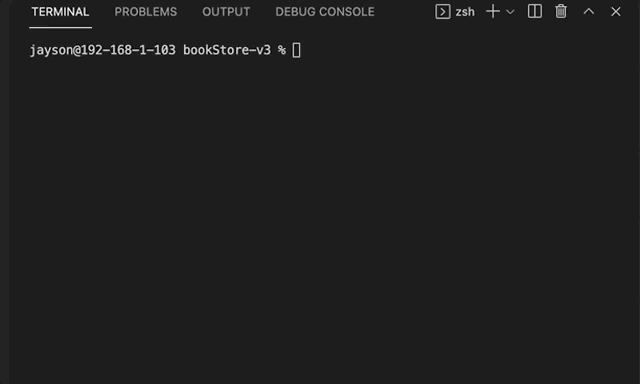

# BookStore-Console Question Helper app

* BookStore was built by composer.
* Using Doctrine DBAL package.
* Using DBAL connect to mySql database.
* Input the book_name, book_publisher and book_price.
* Display the data with symfony console.

# BookStore-Console Question Helper app

* How to run this console app?
* => Git clone => php index.php db:list(db:insert/db:init)

## Drop the table from MySql

## db:list(empty)

## db:init

## db:insert

## db:list

## db:list(mysql) 

## Reference

* Psr-4 => https://stackoverflow.com/questions/60918843/how-to-create-a-psr-4-autoloader-for-my-project
* Create Databse => https://www.doctrine-project.org/projects/dbal.html
* Creating a Console Application => https://symfony.com/doc/current/components/console.html
* Schema-Manager => https://www.doctrine-project.org/projects/doctrine-dbal/en/2.9/reference/schema-manager.html#schema-manager
* Console Question Helper => https://symfony.com/doc/current/components/console/helpers/questionhelper.html
